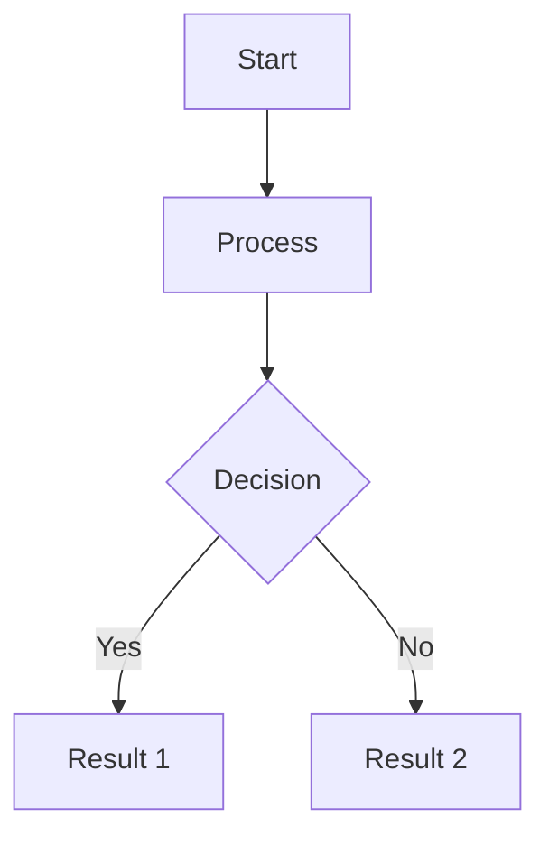
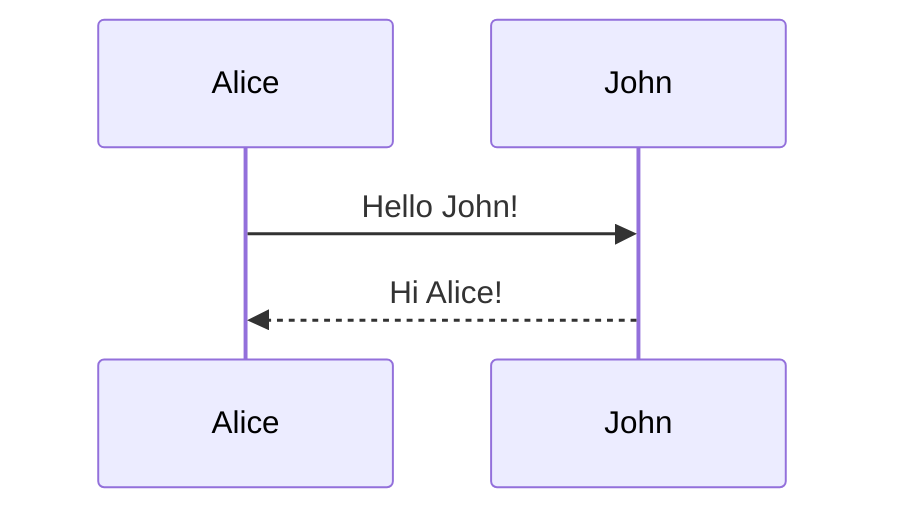

# Markdown Collab

A real-time collaborative markdown diagram editor built with ASP.NET Core, SignalR, and Mermaid.js.

## Features

- 🔒 Password-protected site access
- 📊 Real-time collaborative Mermaid diagram editing
- 🎲 Auto-generated room codes for sharing
- 💾 Persistent diagram storage with PostgreSQL
- 🔄 Reset diagrams at any time
- 🚀 Deployable to Railway

## Technology Stack

- **Backend**: ASP.NET Core 9.0 with Razor Pages
- **Real-time**: SignalR for WebSocket communication
- **Database**: PostgreSQL (with in-memory fallback for development)
- **Diagrams**: Mermaid.js
- **Hosting**: Railway-ready with automatic SSL

## Local Development

### Prerequisites

- .NET 9.0 SDK
- PostgreSQL (optional - will use in-memory database if not configured)

### Running Locally

1. Clone the repository

2. **IMPORTANT - Security Setup**:
   ```bash
   # Copy the example file and set your own password
   cp appsettings.Development.json.example appsettings.Development.json

   # Edit the file and change "your-local-dev-password-here" to your password
   ```

   The `appsettings.Development.json` file is in `.gitignore` and will **NEVER** be committed to git.

3. Run the application:
   ```bash
   dotnet run
   ```

4. Navigate to `http://localhost:5000` and login with your password

## Deploying to Railway

### Step 1: Create a New Project

1. Go to [Railway](https://railway.app)
2. Click "New Project"
3. Choose "Deploy from GitHub repo" and select this repository

### Step 2: Add PostgreSQL Database

1. In your Railway project, click "New"
2. Select "Database" → "Add PostgreSQL"
3. Railway will automatically create a `DATABASE_URL` environment variable

### Step 3: Configure Environment Variables

In your Railway project settings, add these environment variables:

- `SitePassword`: Your secure site password (required for access)
- `ASPNETCORE_ENVIRONMENT`: Set to `Production`
- `ASPNETCORE_URLS`: Set to `http://0.0.0.0:$PORT`

The `DATABASE_URL` is automatically provided by Railway's PostgreSQL service.

### Step 4: Deploy

Railway will automatically detect the .NET application and deploy it using the configuration in `nixpacks.toml`.

Your app will be available at: `https://your-app-name.up.railway.app`

## Usage

### Logging In

1. Navigate to the site
2. Enter the site password (default: `changeme`)

### Creating a Diagram Room

1. Click "Create New Diagram Room"
2. Share the generated room code with collaborators
3. Click "Enter Room" to start editing

### Joining a Room

1. Enter a room code in the "Join Existing Room" field
2. Click "Join Room"

### Editing Diagrams

- Type Mermaid diagram syntax in the left panel
- See live preview in the right panel
- Changes sync in real-time with all connected users
- Click "Reset Diagram" to restore the default diagram

### Mermaid Syntax Examples





Learn more at [Mermaid Documentation](https://mermaid.js.org/)

## Security Features

- Password-protected site access
- Session-based authentication
- HTTPS enforced in production
- Secure WebSocket connections
- SQL injection protection via Entity Framework

## Configuration

### appsettings.json

```json
{
  "SitePassword": "your-password-here",
  "ConnectionStrings": {
    "DefaultConnection": "your-connection-string"
  }
}
```

### Environment Variables (Railway)

- `SitePassword`: Site access password
- `DATABASE_URL`: PostgreSQL connection (auto-provided by Railway)
- `ASPNETCORE_ENVIRONMENT`: Set to `Production`

## Project Structure

```
├── Data/
│   └── ApplicationDbContext.cs    # EF Core database context
├── Hubs/
│   └── DiagramHub.cs              # SignalR hub for real-time updates
├── Middleware/
│   └── PasswordProtectionMiddleware.cs  # Site password protection
├── Models/
│   └── DiagramRoom.cs             # Room data model
├── Pages/
│   ├── Index.cshtml               # Home page (room selection)
│   ├── Room.cshtml                # Collaborative editor
│   ├── Login.cshtml               # Password authentication
│   └── Api/Rooms/Create.cshtml    # Room creation API
├── Services/
│   └── RoomService.cs             # Room management logic
├── Program.cs                      # Application startup
├── appsettings.json               # Configuration
├── railway.json                   # Railway deployment config
└── nixpacks.toml                  # Nixpacks build config
```

## License

MIT License
