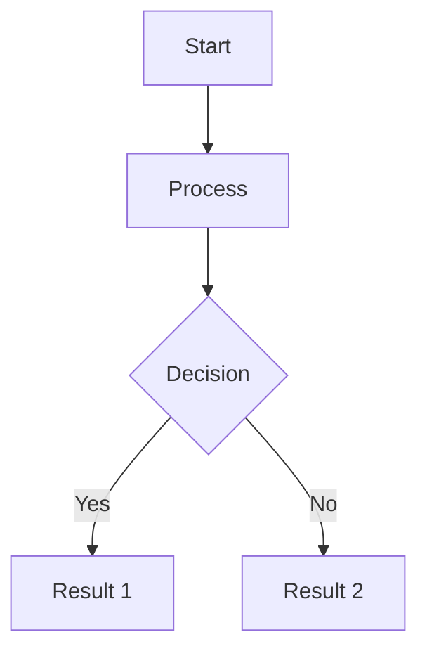
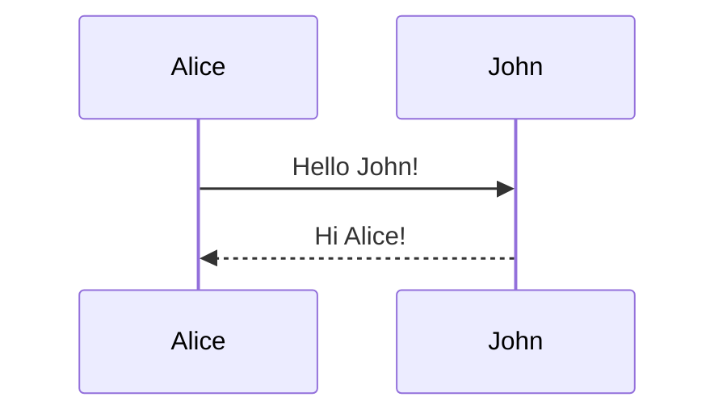

# Markdown Collab

A real-time collaborative markdown diagram editor built with ASP.NET Core, SignalR, and Mermaid.js.

## Features

- 🔒 Password-protected site access
- 📊 Real-time collaborative Mermaid diagram editing
- 🎲 Auto-generated room codes for sharing
- 💾 Persistent diagram storage with PostgreSQL
- 🔄 Reset diagrams at any time
- 🚀 Deployable to Railway

## Technology Stack

- **Backend**: ASP.NET Core 9.0 with Razor Pages
- **Real-time**: SignalR for WebSocket communication
- **Database**: PostgreSQL (with in-memory fallback for development)
- **Diagrams**: Mermaid.js
- **Frontend**: Vanilla JavaScript with Marked.js, DOMPurify, and Mermaid.js
- **Hosting**: Railway-ready with automatic SSL

## Prerequisites

**Required:**
- [.NET 9.0 SDK](https://dotnet.microsoft.com/download/dotnet/9.0)

**Optional (for production):**
- PostgreSQL 12+ (will use in-memory database if not configured)
- Railway account (for deployment)

## Quick Start

1. **Clone the repository**
   ```bash
   git clone https://github.com/yourusername/markdown-collab.git
   cd markdown-collab
   ```

2. **Set up local development password**
   ```bash
   cp appsettings.Development.json.example appsettings.Development.json
   ```

   Edit `appsettings.Development.json` and change `"your-local-dev-password-here"` to your password.

   **Important:** The `appsettings.Development.json` file is in `.gitignore` and will **NEVER** be committed to git.

3. **Run the application**
   ```bash
   dotnet run
   ```

4. **Open in browser**

   Navigate to `http://localhost:5000` and login with your password

**Note:** Without PostgreSQL configured, the app uses an in-memory database (data is lost on restart).

## Local Development with PostgreSQL

1. **Install PostgreSQL** (if not already installed)
   - macOS: `brew install postgresql@15`
   - Windows: Download from [postgresql.org](https://www.postgresql.org/download/)
   - Linux: `sudo apt-get install postgresql`

2. **Create database**
   ```bash
   createdb markdown-collab
   ```

3. **Update connection string**

   Edit `appsettings.json`:
   ```json
   "ConnectionStrings": {
     "DefaultConnection": "Host=localhost;Port=5432;Database=markdown-collab;Username=your_username"
   }
   ```

4. **Run and test**
   ```bash
   dotnet run
   ```

   Database tables are created automatically on first run

## Deploying to Railway

### Step 1: Create a New Project

1. Go to [Railway](https://railway.app)
2. Click "New Project"
3. Choose "Deploy from GitHub repo" and select this repository

### Step 2: Add PostgreSQL Database

1. In your Railway project, click "New"
2. Select "Database" → "Add PostgreSQL"
3. Railway will automatically create a `DATABASE_URL` environment variable

### Step 3: Configure Environment Variables

In your Railway project settings, add these environment variables:

- `SitePassword`: Your secure site password (required for access)
- `ASPNETCORE_ENVIRONMENT`: Set to `Production`
- `ASPNETCORE_URLS`: Set to `http://0.0.0.0:$PORT`

The `DATABASE_URL` is automatically provided by Railway's PostgreSQL service.

### Step 4: Deploy

Railway will automatically detect the .NET application and deploy it using the configuration in `nixpacks.toml`.

Your app will be available at: `https://your-app-name.up.railway.app`

### Troubleshooting Railway Deployment

**App won't start:**
- Check Railway logs for errors
- Verify `SitePassword` environment variable is set
- Confirm PostgreSQL service is linked to your application

**Database connection issues:**
- Ensure `DATABASE_URL` is available (Railway auto-provides this when PostgreSQL is added)
- Check PostgreSQL service is running in Railway dashboard
- Review connection logs in Railway's deployment logs

## Usage

### Logging In

1. Navigate to the site
2. Enter the site password (default: `changeme`)

### Creating a Diagram Room

1. Click "Create New Diagram Room"
2. Share the generated room code with collaborators
3. Click "Enter Room" to start editing

### Joining a Room

1. Enter a room code in the "Join Existing Room" field
2. Click "Join Room"

### Editing Diagrams

- Type Mermaid diagram syntax in the left panel
- See live preview in the right panel
- Changes sync in real-time with all connected users
- Click "Reset Diagram" to restore the default diagram

### Mermaid Syntax Examples





Learn more at [Mermaid Documentation](https://mermaid.js.org/)

## Configuration Reference

### appsettings.Development.json (Local Development)

- `SitePassword`: Password to access the site (required)
- `DetailedErrors`: Enable detailed error pages (default: `true`)

### appsettings.json

- `ConnectionStrings.DefaultConnection`: PostgreSQL connection string (optional - falls back to in-memory database)
- `Logging.LogLevel`: Logging configuration
- `AllowedHosts`: Allowed host headers (default: `*`)

### Environment Variables (Production/Railway)

| Variable | Required | Description |
|----------|----------|-------------|
| `SitePassword` | Yes | Site access password |
| `DATABASE_URL` | No | PostgreSQL connection URL (auto-provided by Railway) |
| `ASPNETCORE_ENVIRONMENT` | Yes | Set to `Production` |
| `ASPNETCORE_URLS` | Yes | Set to `http://0.0.0.0:$PORT` |

## Development

### Building
```bash
dotnet build
```

### Running with hot reload
```bash
dotnet watch run
```

### Docker build (local testing)
```bash
docker build -t markdown-collab .
docker run -p 5000:5000 -e SitePassword=your-password markdown-collab
```

Access at `http://localhost:5000`

## Security

- **Site-wide password protection** via session-based authentication
- **HTTPS enforced** in production environments
- **Rate limiting** on authentication (5 attempts/min) and room creation (10 attempts/min) endpoints
- **SQL injection protection** via Entity Framework Core parameterization
- **XSS protection** via DOMPurify sanitization on client-side
- **Secure WebSocket connections** (wss:// in production)
- **Session management** with 24-hour idle timeout

**Important:** Never commit `appsettings.Development.json` or `.env` files (both are in `.gitignore`)

## Project Structure

```
├── Common/
│   └── ApplicationConstants.cs         # Application-wide constants
├── Controllers/
│   └── RoomsController.cs              # Room API endpoints
├── Data/
│   └── ApplicationDbContext.cs         # EF Core database context
├── Hubs/
│   └── DiagramHub.cs                   # SignalR hub for real-time updates
├── Middleware/
│   └── PasswordProtectionMiddleware.cs # Site password protection
├── Models/
│   └── DiagramRoom.cs                  # Room data model
├── Pages/
│   ├── Index.cshtml                    # Home page (room selection)
│   ├── Room.cshtml                     # Collaborative editor
│   ├── Login.cshtml                    # Password authentication
│   └── Api/Rooms/Create.cshtml         # Room creation API
├── Services/
│   └── RoomService.cs                  # Room management logic
├── wwwroot/                            # Static files (CSS, JS, images)
├── Program.cs                          # Application startup & configuration
├── appsettings.json                    # Configuration
├── appsettings.Development.json.example # Local development config template
├── Dockerfile                          # Docker container definition
├── railway.json                        # Railway deployment config
└── nixpacks.toml                       # Nixpacks build config
```

## Contributing

1. Fork the repository
2. Create a feature branch (`git checkout -b feature/amazing-feature`)
3. Commit your changes (`git commit -m 'Add amazing feature'`)
4. Push to the branch (`git push origin feature/amazing-feature`)
5. Open a Pull Request

## License

MIT License
